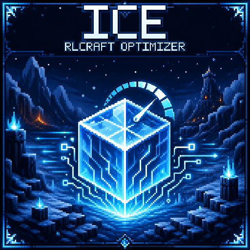

# ICE RLCraft Optimizer

<p align="center">
  
</p>

<p align="center">
  <a href="#中文">中文</a> · <a href="#english">English</a> ·
  <a href="https://github.com/5Mr-Liu/iceoptimizer/releases/latest">Releases</a>
</p>

---

## 中文

ICE RLCraft Optimizer 是面向 Minecraft 1.12.2 RLCraft 系整合包的客户端与专用服务端性能优化模组。它针对实际卡顿热点提供精确的字节码适配、受预算约束的缓存与工作队列，并在目标代码结构不兼容时保留原实现。

本仓库只包含优化器，不包含性能记录、采样、Session、报告导出或 F8/F9/F10 功能。

### 运行环境

| 项目 | 要求 |
| --- | --- |
| Minecraft | 1.12.2 |
| Forge | 14.23.5.2860 |
| Java | Java 8 |
| 当前版本 | 0.9.4 |
| 模组 ID | `iceoptimizer` |
| 运行端 | 客户端与服务端 |
| 已重点验证 | RLCraft 2.9.3、RLCraft Dregora 1.1.2b / DregoraRL 3.9 |

0.8.0 起不再按整个整合包版本或 JAR SHA-256 阻止优化。0.9.1 允许同一个目标类串联多个独立能力；0.9.2 增加 OptiFine 动态光快照、Rustic 栅栏状态/AABB 复用、Fermium 后置线程限制和可靠的 TextureUtil PBO 入口；0.9.3 修复普通 RLCraft Better Caves 热循环中的模块开关线性查找回退；0.9.4 修复 TextureUtil 在 Forge pre-init 前跨主/Core JAR 解析导致的启动崩溃。每项仍只检查自己必需的字段、方法描述符和调用关系。

这并不代表任意修改版整合包都受到正式支持。出现问题时请先在上述已验证环境中复现。

### 安装

推荐从 [GitHub Releases](https://github.com/5Mr-Liu/iceoptimizer/releases/latest) 下载完整安装包：

```text
ice-rlcraft-optimizer-bundle-0.9.4.zip
```

解压后把其中两个 JAR 一起放入实例的 `mods` 目录：

```text
ice-rlcraft-optimizer-0.9.4.jar
ice-rlcraft-optimizer-core-0.9.4.jar
```

Core JAR 是必需组件，不是可选依赖。也可以分别下载两个 JAR，但版本必须完全一致，不能把 0.9.3 Core 与 0.9.4 主包混装。

- 单人游戏：安装到客户端实例。
- 多人游戏：客户端和专用服务端都必须安装两个文件。
- Forge 握手要求客户端与服务端的 ICE Optimizer 主 JAR 版本完全相同。
- 升级前请删除旧版 `ice-rlcraft-runtime-*`、旧 optimizer 主 JAR 和旧 optimizer core JAR。

启动并进入世界后打开原版 F3 调试界面，右侧会显示三行紧凑的 `ICE Opt` / `ICE Chunk` / `ICE Q` 状态。普通游戏画面没有额外 HUD。

### 如何确认在不同电脑上确实生效

性能提升不是固定的 FPS 倍数：CPU 主线程、集成服务器、区块重建、GPU、显存、GC 或磁盘中的任何一项都可能是某台电脑的真实瓶颈。先看 F3，而不要只凭平均 FPS 判断：

- `CORE OK`：两个 JAR 都已正确加载；`CORE MISSING` 表示底层补丁完全没有安装成功。
- `PATCH`：通过结构校验并安装的模块数量；它不代表对应热点已经发生。
- `HIT`：本次启动中确实执行过优化分支的模块数量。进入世界、移动和触发相关内容后应逐渐增加。
- `MISS`：已经观察到目标类，但该模块至少有一项独立能力因结构不兼容而未安装；其他兼容能力仍会继续工作。
- `ICE Chunk: W 16>8 B32`：原版会创建 16 个 Worker，当前自适应为 8 个并使用 32 个构建器。不同 CPU 会显示不同数字。
- `Sort`：实际完成原始类型透明四边形排序的累计数量；只有透明区块重建时才增长。
- `GPU GL31-COPY 120/3` 或 `GPU ARB-COPY 120/3`：120 次区块上传走核心或 ARB GPU copy、3 次安全回退。`UNSUPPORTED`、`BUSY`、`BUDGET`、`ABI-MISSING` 或 `CORE-MISSING` 会直接说明为什么这台电脑没有走该路径。

比较前后版本时，应使用同一存档、同一路线、相同视距与 JVM 参数，先完成资源加载和区块热身，再比较帧时间 P95/P99 与卡顿峰值。显卡已经空闲而 CPU 主线程满载的电脑，不会因为 GPU 上传优化获得明显平均 FPS；反过来，区块没有重建时，区块流水线计数也不会增长。

### 主要优化

- **SRParasites**：热点模型静态分支批处理、单次寻路节点缓存、最近目标线性选择及部分姿态/粒子路径。
- **Lycanites Mobs**：寻路节点缓存、注册表单次探测、OBJ/VBO 稳定分组、动画/效果热路径及低分配刷怪位置扫描。
- **原版区块渲染**：按逻辑处理器与 JVM 堆分档选择 1–16 个 Worker（且不超过原值），限制过量 Direct Buffer 构建器；线程策略、上传入口、透明排序和 VBO 访问独立安装。GPU copy 同时支持 OpenGL 核心接口与 `GL_ARB_copy_buffer` / `GL_ARB_sync` 扩展组合。
- **原版世界保存**：仅在同步全量区块保存范围内建立计划刻临时索引，避免每个区块重复扫描世界级集合。
- **Mo' Bends / Ice and Fire**：父链、四元数、姿态查询及低分配粒子参数路径。
- **FoamFix / TextureUtil / Xaero**：动画纹理上传暂存、三槽 PBO/Fence、原版 TextureUtil 入口和非阻塞 GPU 计时路径。
- **OptiFine / Rustic / RenderLib / OreLib / Better Foliage / Dynamic Trees**：动态光不可变快照与空间索引、栅栏状态/AABB 复用、方块实体合并、GL 状态快照、AO 暂存和连接数据复用。
- **Better Caves**：原始类型噪声存储、深复制列缓存、插值临时对象收敛、连续阈值表，以及不再线性扫描模块目录的实时熔断门。
- **Quality Tools / Quark**：稳定装备属性复用与掉落物同步状态的低分配实现。
- **Open Terrain Generator / BO4**：冗余源文件回写抑制、低分配配置解析、方块数组和列偏移复用。
- **玩家头颅**：将不完整资料的 Authlib 网络解析移出渲染线程，并使用有界缓存与队列。

具体模块可以在 `config/ice-optimizer.cfg` 中独立关闭。

0.9.4 的 `TextureUtil` 注入只直接依赖 Core 内的自包含引导桥。普通 optimizer 主 JAR 尚未进入 Forge pre-init 时，引导桥返回未处理并执行原版/FoamFix 上传；运行时就绪后再安装 MethodHandle 委托，因此不会在帧缓冲初始化阶段解析尚不可见的主 JAR 类。

### 行为与安全边界

优化器的目标是减少重复计算、分配、同步等待和高频容器开销。它不会故意：

- 删除实体、粒子、模型或游戏内容；
- 跳过游戏 Tick 或降低 AI 更新频率；
- 修改掉落、随机数调用、世界生成结果或写入顺序；
- 把世界或存档写入移动到未经验证的异步线程；
- 在普通运行中生成性能采集 Session。

每个模块拥有独立状态和连续错误熔断。缓存、Heap、Direct、GPU、CPU 队列和渲染队列均设有硬上限；任何校验、预算或生命周期条件不满足时都会使用原路径。

### 隐私与磁盘写入

默认 `settings.developmentDiskOutput=false`。正常安装只会产生 Forge 配置和 Minecraft/Forge 的常规日志；不会导出目标类、整合包组件快照或性能采集报告。

只有开发新适配器时才应启用 `developmentDiskOutput`。提交 Issue 前请自行检查并删除日志中的用户名、本机路径、服务器地址或其他不希望公开的信息。

### 从源码构建

要求 Java 8：

```powershell
./gradlew.bat clean test build
```

Linux/macOS：

```bash
./gradlew clean test build
```

正式产物位于：

```text
build/libs/ice-rlcraft-optimizer-<version>.jar
build/libs/ice-rlcraft-optimizer-core-<version>.jar
build/libs/ice-rlcraft-optimizer-bundle-<version>.zip
```

部分真实目标 JAR 回归测试需要通过 Gradle 属性提供本地测试夹具；缺少这些可选夹具不会影响普通源码构建和核心单元测试。

### 许可证

项目使用 [MIT License](LICENSE)。最终优化器主 JAR 私有重定位了 Agrona、Caffeine 和 lz4-java；详情见 [THIRD_PARTY_NOTICES.md](THIRD_PARTY_NOTICES.md)。

---

## English

ICE RLCraft Optimizer is a client and dedicated-server performance mod for Minecraft 1.12.2 RLCraft-family packs. It applies narrowly scoped bytecode adapters, bounded caches, and bounded worker queues to measured hot paths, while preserving the original implementation whenever a target is structurally incompatible.

This repository contains the optimizer only. It does not include performance recording, sampling, sessions, report export, or F8/F9/F10 features.

### Runtime requirements

| Item | Requirement |
| --- | --- |
| Minecraft | 1.12.2 |
| Forge | 14.23.5.2860 |
| Java | Java 8 |
| Current version | 0.9.4 |
| Mod ID | `iceoptimizer` |
| Environment | Client and server |
| Primary test targets | RLCraft 2.9.3 and RLCraft Dregora 1.1.2b / DregoraRL 3.9 |

Since 0.8.0, pack versions and whole-JAR SHA-256 values no longer gate optimizations. Version 0.9.1 allows multiple independent capabilities on one target class; 0.9.2 adds OptiFine dynamic-light snapshots, Rustic lattice state/AABB reuse, post-Fermium worker limits, and a reliable TextureUtil PBO entry; 0.9.3 removes the linear module-gate lookup exposed by Better Caves in standard RLCraft; 0.9.4 fixes the cross-main/Core class resolution that could crash TextureUtil before Forge pre-init. Each capability still validates only the fields, descriptors, and call relationships it requires.

This does not make every modified pack an officially supported target. Please reproduce issues on one of the primary test environments first.

### Installation

The recommended download from [GitHub Releases](https://github.com/5Mr-Liu/iceoptimizer/releases/latest) is the complete bundle:

```text
ice-rlcraft-optimizer-bundle-0.9.4.zip
```

Extract it and place both contained JARs in the instance `mods` directory:

```text
ice-rlcraft-optimizer-0.9.4.jar
ice-rlcraft-optimizer-core-0.9.4.jar
```

The Core JAR is required; it is not an optional dependency. The two JARs may also be downloaded separately, but their versions must match exactly; do not mix a 0.9.3 Core JAR with the 0.9.4 main JAR.

- Single player: install both files in the client instance.
- Multiplayer: install both files on every client and on the dedicated server.
- The Forge handshake requires the ICE Optimizer main JAR to have the exact same version on both sides.
- Remove old `ice-rlcraft-runtime-*`, optimizer, and optimizer-core JARs before upgrading.

Enter a world and open the vanilla F3 debug screen to see the compact `ICE Opt`, `ICE Chunk`, and `ICE Q` lines. No regular HUD is displayed.

### Verifying that it really runs on another PC

Performance is not a fixed FPS multiplier: the limiting resource may be the CPU main thread, integrated server, chunk rebuilding, GPU, VRAM, GC, or storage on a particular machine. Check F3 before judging by average FPS alone:

- `CORE OK` means both JARs loaded. `CORE MISSING` means the low-level patches are not installed at all.
- `PATCH` counts modules whose bytecode passed structural validation and was installed; it does not mean that workload has occurred.
- `HIT` counts modules whose optimized branch actually ran during this launch. It should rise after entering a world and exercising the relevant content.
- `MISS` means a target was observed but at least one independent capability in that module did not match; other compatible capabilities continue to run.
- `ICE Chunk: W 16>8 B32` means vanilla requested 16 workers while the hardware policy selected 8 workers and 32 builders. Values differ by CPU.
- `Sort` counts translucent quads processed by the primitive sorter and only grows during translucent chunk rebuilds.
- `GPU GL31-COPY 120/3` or `GPU ARB-COPY 120/3` means 120 core/ARB staged GPU-copy uploads and three safe fallbacks. `UNSUPPORTED`, `BUSY`, `BUDGET`, `ABI-MISSING`, or `CORE-MISSING` states explain why that PC did not use the path.

For before/after comparisons, use the same save, route, render distance, and JVM arguments; allow resource and chunk warm-up first; then compare P95/P99 frame time and hitch peaks. A PC that is CPU-main-thread limited will not gain much average FPS from a GPU-upload optimization, and the chunk-pipeline counters will not move while no chunks are being rebuilt.

### Main optimization areas

- **SRParasites**: hot model branch batching, per-search path-node caching, stable linear target selection, and selected pose/particle paths.
- **Lycanites Mobs**: path-node caching, single registry probes, stable OBJ/VBO grouping, animation/effect hot paths, and low-allocation spawn-position scans.
- **Vanilla chunk rendering**: choose 1–16 workers from logical CPU count and JVM heap without exceeding vanilla's value; install dispatcher policy, upload entry, translucent sorting, and VBO access independently; support both core OpenGL and `GL_ARB_copy_buffer` / `GL_ARB_sync` combinations.
- **Vanilla world saves**: a temporary scheduled-tick index scoped only to synchronous full chunk saves, avoiding repeated world-wide collection scans for every chunk.
- **Mo' Bends / Ice and Fire**: parent topology, quaternion matrices, pose lookup, and low-allocation particle arguments.
- **FoamFix / TextureUtil / Xaero**: animated-texture staging, triple-slot PBO/Fence paths, a vanilla TextureUtil entry, and non-blocking GPU timing.
- **OptiFine / Rustic / RenderLib / OreLib / Better Foliage / Dynamic Trees**: immutable dynamic-light snapshots and spatial indexing, lattice state/AABB reuse, tile-entity merging, GL state snapshots, AO scratch reuse, and connection memoization.
- **Better Caves**: primitive noise storage, deep-copy column caching, collapsed interpolation temporaries, contiguous threshold maps, and a live circuit-breaker gate without linear module scans.
- **Quality Tools / Quark**: stable equipment-attribute reuse and lower-allocation dropped-item synchronization state.
- **Open Terrain Generator / BO4**: redundant source rewrite suppression, lower-allocation parsing, and per-spawn block-array/layout reuse.
- **Player skulls**: bounded off-render-thread Authlib profile resolution for incomplete profiles.

In 0.9.4, transformed TextureUtil code links only to a self-contained bootstrap in the Core JAR. Before the regular optimizer reaches Forge pre-init, the bootstrap declines the optimized upload and the untouched Minecraft/FoamFix path runs. Once the runtime is ready it installs MethodHandle delegates, avoiding both the startup linkage failure and per-upload class-name reflection.

Individual modules can be disabled in `config/ice-optimizer.cfg`.

### Behavioral and safety boundaries

The optimizer reduces repeated computation, allocation, synchronization stalls, and hot-container overhead. It is not intended to:

- remove entities, particles, models, or game content;
- skip ticks or lower AI update rates;
- change drops, random-number calls, world-generation results, or write ordering;
- move world/save writes to unverified asynchronous threads;
- create performance-capture sessions during normal operation.

Every module has independent state and a consecutive-error circuit breaker. Heap, direct-memory, GPU, CPU-queue, and render-queue usage is bounded. Failed validation, rejected budgets, or lifecycle mismatches use the original path.

### Privacy and disk output

`settings.developmentDiskOutput=false` by default. A normal installation only creates the Forge configuration and regular Minecraft/Forge logs; it does not export target classes, component snapshots, or profiling reports.

Only enable `developmentDiskOutput` while developing a new adapter. Before attaching logs to an issue, review and remove usernames, local paths, server addresses, or any other information you do not want to publish.

### Building from source

Java 8 is required.

Windows:

```powershell
./gradlew.bat clean test build
```

Linux/macOS:

```bash
./gradlew clean test build
```

Release artifacts are written to:

```text
build/libs/ice-rlcraft-optimizer-<version>.jar
build/libs/ice-rlcraft-optimizer-core-<version>.jar
build/libs/ice-rlcraft-optimizer-bundle-<version>.zip
```

Some real-target regression tests accept local fixture JARs through Gradle properties. Those optional fixtures are not required for the normal source build and core unit tests.

### License

The project is licensed under the [MIT License](LICENSE). The optimizer main JAR privately relocates Agrona, Caffeine, and lz4-java; see [THIRD_PARTY_NOTICES.md](THIRD_PARTY_NOTICES.md) for details.
